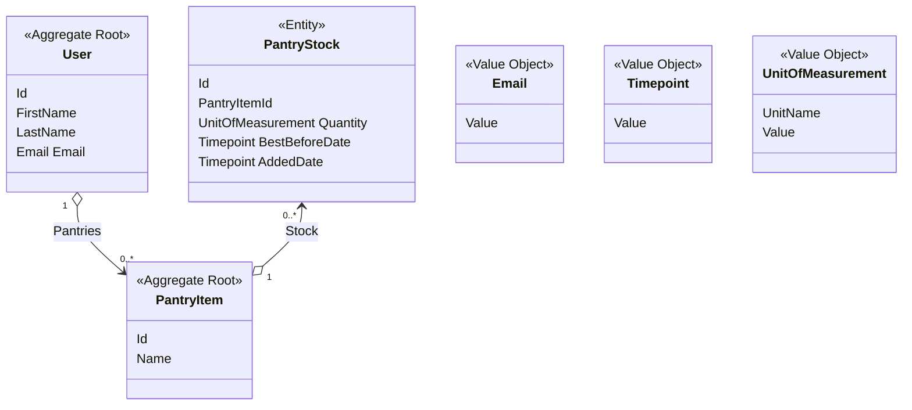

# pantry-tracker

A web site to help tracking pantry items

## Domain Model

## Use Cases

- Login and Registration

  We will use GMail for Login and Registration

- Purchase and Record the Items

  Normal Flow:

  1. So the user woke up in the morning and go to the nearest grocery store.
  1. He purchase several items
  1. When he arrived at home, he store the groceries to their places
  1. He then open the web site from his mobile phone to record the groceries
  1. The pantry list is still empty so he add a new one
  1. He enters the :

  - Pantry name. The system provide lookup values for the pantry name but he can freely enter new value.
  - Pantry stock
  - Best before date
  - Make sure the added date is correct

  7. Then he submit the new pantry data
  8. The system validates the data
  9. The system record the data
  10. The system then notify the new data has been saved
  11. He then continue to add the remaining items

  Alternate Flow:

  1. So the user woke up in the morning and wants to go to the nearest grocery store
  2. He wants to know which groceries needs to be restocked
  3. He open the web site from his mobile phone
  4. He choose the option to show `Needs to Restock` items
  5. The system display the pantries sorted by quantity value in ascending order
  6. He scroll the items and filtered out some items until he satisfied with the remaining items that needs restocked
  7. He change his mind to one or more items and wants to move them to the `Needs to Restock` section
  8. He choose rthe option to show `Doesn't Restock` items
  9. And choose the items that he wants to move to `Needs to Restock` section
  10. He then continue to go the grocery store
  11. He purchase groceries guided by the `Needs to Restock` items
  12. He also purchase more groceries that is new
  13. Arrived at home he store the groceries
  14. Then he recorded the purchased items
  15. He resume step 6 from the Normal Flow above

-
